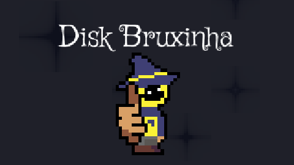

# Disk Bruxinha 🧹✨

<p align="center">
  
</p>

<p align="center">
  <strong>Um jogo de plataforma 2D sobre entregas, magia e carimbos.</strong><br>
  Criado para a FelpoJam pela equipe Caveiras Carentes.
</p>

## Sobre o jogo

Você é um novato do Correio em um mundo mágico habitado por criaturas peculiares. Sua missão é coletar encomendas, atravessar os desafios de cada região e entregá-las aos destinatários corretos antes de encerrar o expediente.

O tema da jam, **Carimbo**, virou a mecânica central do jogo: cada cor aplica uma habilidade diferente aos blocos marcados e abre novas possibilidades de exploração, com um toque de metroidvania.

### Carimbos

| Carimbo | Efeito |
| --- | --- |
| 🔵 Azul | Aumenta a velocidade enquanto o efeito está ativo. |
| 🟠 Laranja | Aumenta a força do pulo. |
| 🔴 Vermelho | Torna blocos frágeis e permite quebrá-los. |
| 🧴 Removedor | Remove carimbos próximos. |

Além dos carimbos, o jogador pode andar, executar pulos de altura variável, carregar e arremessar objetos, conversar com NPCs e acompanhar suas entregas.

## Controles

| Ação | Teclado | Controle |
| --- | :---: | :---: |
| Mover | `A` / `D` | Analógico |
| Pular | `Espaço` | `A` |
| Carimbo azul | `J` | `X` |
| Carimbo laranja | `K` | `Y` |
| Carimbo vermelho | `L` | `B` |
| Interagir | `E` | `RB` |
| Remover carimbo | `R` | `LB` |
| Arremessar objeto | `Shift` | `LT` |
| Ver entregas | `Q` | `Select` |

> Depois da última entrega, volte ao setor de entregas para encerrar o expediente.

## Como executar o projeto

O código-fonte é um projeto do **Godot 4.5**.

1. Instale o [Godot Engine](https://godotengine.org/download/).
2. Importe o arquivo [`source/felpo-jam/project.godot`](source/felpo-jam/project.godot).
3. Abra o projeto no editor e pressione `F5` para iniciar o jogo.

Versões exportadas para Windows, Linux e Web ficam na pasta [`compiled`](compiled), quando disponíveis.

## Estrutura do repositório

```text
FelpoJam/
├── source/felpo-jam/   # projeto, cenas, scripts e recursos do Godot
├── compiled/          # builds exportadas
└── disclaimer/        # avisos exibidos com o jogo
```

## Créditos

| Área | Responsáveis |
| --- | --- |
| Game design | João Anunciação e Guilherme Moreira |
| Programação | João Anunciação |
| Arte e assets | João Anunciação e Guilherme Moreira |
| Música e efeitos sonoros | Guilherme Moreira |

### Ferramentas e referências

- **Ferramentas:** Godot Engine, Audacity, LibreSprite e Laigter.
- **Fonte:** Griffy Regular, por Font Diner.
- **Referências de código:** GDQuest (raycasts), 16BitDev (block breaking), BiLLz Devs (grab objects), Queble (push physics bodies) e Dev'd (dialogs and quests).
- **Shaders:** phillip_parente (CRT-style glitch), KingToot (Pixelize), nojoule (Double Dither) e Juprup (Stars Shaders v2.0).
- **Efeitos sonoros de terceiros:** *Small Button Press*, por adgawrhbshbffsfgvsrf, e *Perc Bip*, por SpiceProgram.

---

Feito por **João Victor Anunciação da Silva** e **Guilherme Moreira dos Santos** — Equipe Caveiras Carentes.
